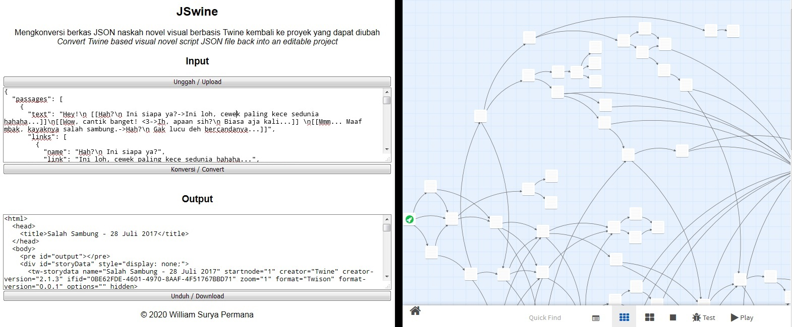
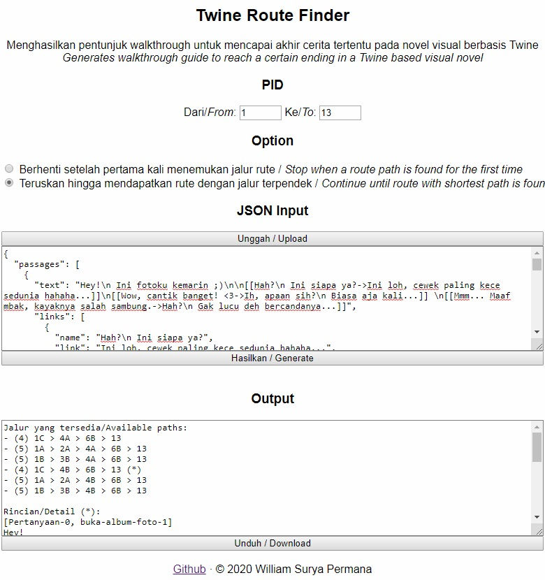

# Twine tool

Twine tool terdiri dari:

*Twine tool is consists of:*

- [JSwine (JSON&rarr;Twine)](#jswine-jsontwine)
- [Route Finder](#route-finder)

## JSwine (JSON&rarr;Twine)

JSwine adalah sebuah pengkonversi yang dapat mengubah berkas JSON hasil ekspor dari [Twine 2](https://twinery.org/2) yang biasanya disertakan sebagai sumber daya dalam permainan serupa novel visual, kembali menjadi proyek aslinya. Dari sini, Anda bisa melihat keseluruhan rute, dan jika mau, mengubah rute dan mengekspornya kembali untuk menggantikan sumber daya sebelumnya.

Intinya, JSwine mengembalikan apa yang dilakukan [Twison](https://github.com/lazerwalker/twison).

*JSwine is a converter which can turn an exported JSON file from [Twine 2](https://twinery.org/2) which is usually included as a resource in visual novel-like games, back into its native project. So you can overview the whole route and even, if you want, edit the route and export it back to replace the original resource.*

*Basically, it reverses what [Twison](https://github.com/lazerwalker/twison) did.*

#### Tangkapan layar/*Screenshot*

#### Coba sekarang/*Try it now*

[https://williamsp.github.io/twine_tool/jswine](https://williamsp.github.io/twine_tool/jswine)

## Route Finder

Seperti namanya, Route Finder adalah alat untuk mencari rute untuk mendapat akhir cerita tertentu dalam novel visual berbasis Twine. Cukup unggah berkas JSON dan masukkan titik yang ingin dituju, maka petunjuk serupa walkthrough akan otomatis dihasilkan.

*As like the name said, Route Finder is a tool for finding a route to get certain a ending in Twine based visual novel. You just need to upload the JSON file and input the desired point, then a walktrough-like guide will be generated automatically.*

#### Tangkapan layar/*Screenshot*

#### Coba sekarang/*Try it now*

[https://williamsp.github.io/twine_tool/route_finder](https://williamsp.github.io/twine_tool/route_finder)