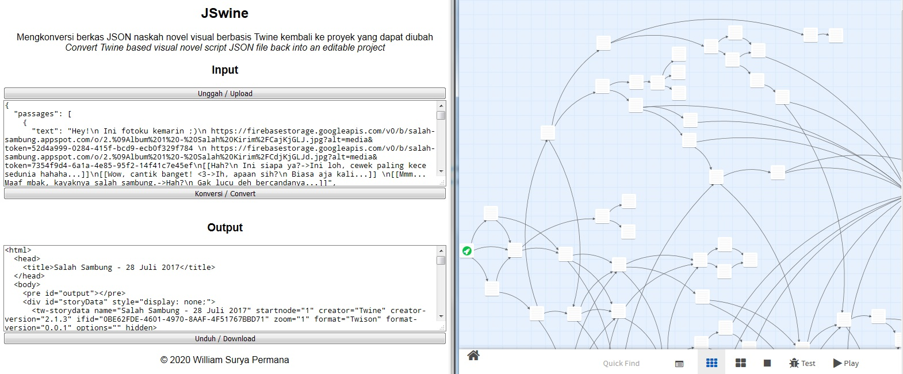

# Twine tool

## JSwine (JSON&rarr;Twine)

JSwine adalah sebuah pengkonversi yang dapat mengubah berkas JSON hasil ekspor dari [Twine 2](http://twinery.org/2) yang biasanya disertakan sebagai sumber daya dalam permainan serupa novel visual, kembali menjadi proyek aslinya. Dari sini, Anda bisa melihat keseluruhan rute, dan jika mau, mengubah rute dan mengekspornya untuk menggantikan sumber daya sebelumnya.

Intinya, JSwine mengembalikan apa yang dilakukan [Twison](https://github.com/lazerwalker/twison).

*JSwine is a converter which can turn an exported JSON file from [Twine 2](http://twinery.org/2) which is usually included as a resource in visual novel like games, back into its native project. So you can overview the whole route and even, if you want, edit the route and exported it back to replace the original resource.*

*Basically, it reverses what [Twison](https://github.com/lazerwalker/twison) did.*

### Tangkapan layar/*Screenshot*

### Coba sekarang/*Try it now*

[https://williamsp.github.io/twine_tool/jswine](https://williamsp.github.io/twine_tool/jswine)
